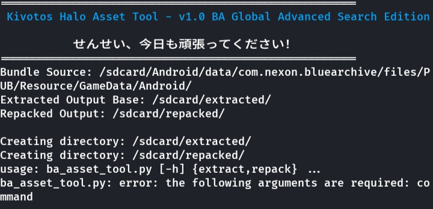

# Kivotos Halo Asset Tool
A command-line Python script designed to extract and repack Unity asset bundles from the game **Blue Archive**. It features an advanced interactive menu for selecting bundles and is specifically tailored for the game's file structure.

せんせい、今日も頑張ってください！ (Sensei, please do your best today!)





---

## 🚨 Critical Prerequisite: Rooted Android Environment

This script is **NOT** designed to run on a standard Windows, macOS, or desktop Linux environment out of the box. It is built specifically for a **rooted Android environment** where it can directly access the game's data files.

*   **Why?** The script uses hardcoded paths like `/sdcard/Android/data/com.nexon.bluearchive/...` which are protected by the Android operating system. Without root, these files are inaccessible.
*   **Recommended Environments:**
    *   **Termux with proot-distro:** This is the ideal way to run it. You must install a Linux distribution (like Ubuntu or Debian) inside Termux and run the script from within the proot environment.
        ```bash
        # Inside Termux
        pkg install proot-distro
        proot-distro install ubuntu
        proot-distro login ubuntu
        # Now you are in a root-like environment where you can run the script
        ```
    *   **Kali Nethunter:** A rooted environment provided by Nethunter will also work.
*   **Alternative (Not Recommended):** You could manually copy the entire `Resource` folder from your phone to a PC and modify the paths at the top of the script, but the primary design is for on-device execution.

## Features

*   **Extract & Repack:** The core functionality allows for unpacking game asset bundles and repacking them after modification.
*   **Advanced Interactive Search:** No need to guess bundle filenames.
    *   **Smart Scan:** On startup, the script intelligently finds bundles likely to contain character sprites.
    *   **Filter:** Quickly filter the list of bundles by name.
    *   **Broad Search:** If you can't find a character, you can perform a broad search across all bundle files for a keyword (e.g., "yuuka").
*   **Comprehensive Asset Handling:** Extracts various common asset types into organized folders:
    *   `Texture2D` / `Sprite` → **.png** files
    *   `TextAsset` → **.txt** or **.bytes** files
    *   `MonoBehaviour` → **.json** (if type tree is available) or raw **.dat** files
    *   `AudioClip` → **.wav** (or other formats via UnityPy's export)
*   **Manifest-Based Repacking:** Generates a `manifest.json` during extraction, which ensures a safe and accurate repacking process.
*   **Designed for Blue Archive:** Naming conventions and default paths are tailored for the Global version of Blue Archive.

## Installation

1.  **Set up Your Environment:** Ensure you are inside your rooted `proot-distro` or Nethunter session.

2.  **Install Python:** Most distributions will have Python 3 pre-installed. You can check with `python --version`.

3.  **Install Dependencies:** The script requires `UnityPy` for handling the bundles and `Pillow` for image processing.
    ```bash
    pip install UnityPy Pillow
    ```

4.  **Download the Script:** Download the script (e.g., `ba_asset_tool.py`) into your environment.

## Configuration

The script has configuration variables at the top. You should verify they match your device's setup, especially if you are using a different version of the game (e.g., JP/KR).

```python
# --- Blue Archive Specific Configuration ---
BLUE_ARCHIVE_BUNDLE_SRC_PATH = "/sdcard/Android/data/com.nexon.bluearchive/files/PUB/Resource/GameData/Android/"
DEFAULT_EXTRACTED_OUTPUT_BASE_DIR = "/sdcard/extracted/"
DEFAULT_REPACKED_OUTPUT_DIR = "/sdcard/repacked/"
```

*   `BLUE_ARCHIVE_BUNDLE_SRC_PATH`: Path to the game's asset bundles.
*   `DEFAULT_EXTRACTED_OUTPUT_BASE_DIR`: Where all extracted asset folders will be created.
*   `DEFAULT_REPACKED_OUTPUT_DIR`: Where new, repacked bundles will be saved.

## Usage

The script is operated via a command-line interface with two main commands: `extract` and `repack`.

### Extracting Assets

The `extract` command launches the interactive menu to help you find and unpack a bundle.

**Command:**
```bash
python ba_asset_tool.py extract [output_subfolder_name]
```
*   `[output_subfolder_name]`: (Optional) A custom name for the folder where assets will be extracted. If you omit this, the script will use the bundle's filename.

**Example 1: Basic Extraction**

This will start the interactive menu and, once you select a bundle, extract its contents to a folder named after the bundle inside `/sdcard/extracted/`.

```bash
python ba_asset_tool.py extract
```

**Interactive Menu:**
1.  The script will perform a **Smart Scan** and present a numbered list of likely character sprite bundles.
2.  You can:
    *   Enter a **number** to select and extract a bundle.
    *   Enter **`f`** to filter the current list by a keyword.
    *   Enter a **name** (e.g., `hoshino`) to perform a **Broad Search** for any bundle containing that name and add it to the list.
    *   Enter **`q`** to quit.

**Example 2: Extraction to a Custom Folder**

This will extract the bundle you select to `/sdcard/extracted/MyCustomAru/`.

```bash
python ba_asset_tool.py extract MyCustomAru
```

### Understanding the Extracted Folder

After extraction, your output folder will look something like this:

```
/sdcard/extracted/MyCustomAru/
├── AudioClips/
├── MonoBehaviours_JSON/
├── TextAssets/
├── Textures/
│   ├── Aru_Weapon_Tex_a81234.png
│   └── ...
├── manifest.json  <-- VERY IMPORTANT
└── ...
```

The **`manifest.json`** file is critical. It contains the blueprint of the original bundle and tells the script how to put everything back together. **Do not delete or rename it!**

### Repacking Assets

The `repack` command takes an extracted folder (containing your modifications and the original `manifest.json`) and builds a new `.bundle` file.

**Command:**
```bash
python ba_asset_tool.py repack "path/to/input_dir" "output_filename.bundle"
```
*   `path/to/input_dir`: The full path to the folder containing your modified assets and the `manifest.json`.
*   `output_filename.bundle`: The name you want to give to the new, repacked bundle file. It will be saved in the `DEFAULT_REPACKED_OUTPUT_DIR`.

**Example:**

Let's say you modified the texture files inside `/sdcard/extracted/MyCustomAru/`. To repack it:

```bash
python ba_asset_tool.py repack "/sdcard/extracted/MyCustomAru" "Repacked_Aru_Special.bundle"
```

This will:
1.  Read the `manifest.json` in `/sdcard/extracted/MyCustomAru/`.
2.  Use the original bundle as a template.
3.  Replace the original assets with your modified ones.
4.  Save the new bundle as `/sdcard/repacked/Repacked_Aru_Special.bundle`.

---

## Disclaimer
This is a third-party tool created for educational and personal use. Modifying game files can be against the game's Terms of Service and may lead to unforeseen consequences, including account suspension. Use this tool responsibly and at your own risk. The developer is not responsible for any issues that may arise from its use.
