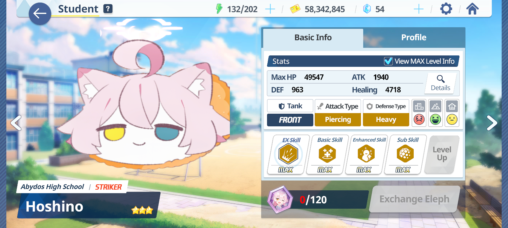

# Kivotos Halo Asset Tool



A flexible, cross-platform toolkit for extracting, repacking, and modding **Blue Archive** Unity asset bundles. Supports both Android (with advanced command-line tools for Termux) and Windows (with a full-featured graphical interface).

---

## WARNING ⚠ The GUI script is not tested due to Blue Archive on steam not available in my country 😭, Please test this tool carefully or send me your game file, huge thank 👍

## 🚩 What is this?

Kivotos Halo Asset Tool is a feature-rich solution for Blue Archive asset modding:
- **On Android**: Automates the complex process of copying, extracting, repacking, and deploying Unity asset bundles, even into protected game storage, using Termux and a Linux container.
- **On Windows**: Provides a powerful and user-friendly graphical application to extract and repack Unity asset bundles with just a few clicks.

---

## 🖥️ Windows GUI Edition

A native Windows graphical interface is included:  
**`ba_asset_tool_gui.py`** (Tkinter-based GUI, requires Python 3, UnityPy, and Pillow).

### Features
- Select bundles and output folders with file dialogs
- One-click extraction and repacking of Unity asset bundles
- User-friendly progress and error messages
- Built-in disclaimer and safety checks
- No command line required

### Quick Start (Windows GUI)

1. **Requirements**:
    - Python 3.8+ for Windows ([download Python](https://www.python.org/downloads/windows/))
    - Dependencies: `pip install UnityPy Pillow`

2. **Run the GUI**:
    - Download or clone this repository
    - Double-click `ba_asset_tool_gui.py`  
      _or_  
      Run in terminal:
      ```bash
      python ba_asset_tool_gui.py
      ```

3. **Usage**:
    - Follow the graphical interface to select files, extract assets, edit, and repack.

> **Note:** This GUI is currently Windows-only. Linux support is planned but not yet implemented.

---

## 📱 Android Command-line Edition

A powerful, automated on-device solution for modding **Blue Archive** on Android, using Termux and a Debian proot-distro container.

### Features
- End-to-end workflow: `copy`, `extract`, `repack`, `deploy`
- Automated setup with a single `install.sh` script
- Smart privilege handling (supports both `su` root and Shizuku)
- Hybrid architecture (Termux "Orchestrator" + Debian "Workshop")

### Prerequisites

- **Termux** app installed from F-Droid or Github
- Device with **root** or **Shizuku** (for protected file access)

### Quick Start (Android CLI)

1. **Download the Installer**  
   Save `install.sh` to your Termux home (`~/`).

2. **Make Executable**  
   ```bash
   chmod +x install.sh
   ```

3. **Run the Installer**  
   ```bash
   ./install.sh
   ```

   This will install everything and create `kivotos_tool.py`.

4. **Modding Workflow (`kivotos_tool.py`)**  
   - `copy <search_term> <folder>`: Copy bundles from the game to your workspace.
   - `process extract <folder>`: Extract copied bundles.
   - Edit your assets as needed.
   - `process repack <subfolder> <new_name.bundle>`: Repack to a new bundle.
   - `deploy <mod_path> <original_name>`: Deploy modded bundle back into the game.

---

## ⚡ Advanced Tool for Linux/Power Users

**`ba_asset_tool.py`**: For use in a root Linux environment (such as Kali NetHunter, root proot-distro, or WSL with access to game files).

- Combines extraction and repacking in a single interactive CLI.
- Features advanced search, "Smart Scan", live filtering, and more.
- Suitable for those who want low-level control.

### Usage
- Ensure Python 3.8+, `UnityPy`, `Pillow` installed.
- Run:
  ```bash
  python ba_asset_tool.py extract
  ```
  or follow CLI prompts for other operations.

---

## 📝 Disclaimer

This is a third-party educational tool. Modifying game files can violate Blue Archive's Terms of Service and may result in penalties, including account suspension. Use at your own risk. The developer is not responsible for any consequences of use.

---

## 📂 License

See [LICENSE](LICENSE) for details.

---

## 💡 More

- Windows GUI: `ba_asset_tool_gui.py`
- Android CLI: `kivotos_tool.py` (via installer)
- Advanced CLI: `ba_asset_tool.py`
- For updates, issues, and more, see the [GitHub repo](https://github.com/minhmc2007/Kivotos-Halo-Asset-Tool).
